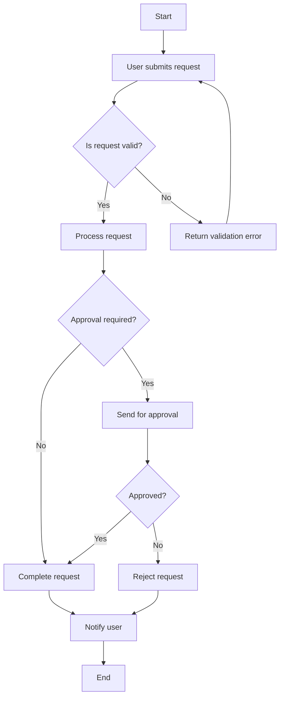
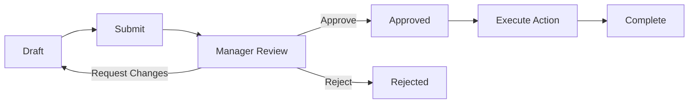
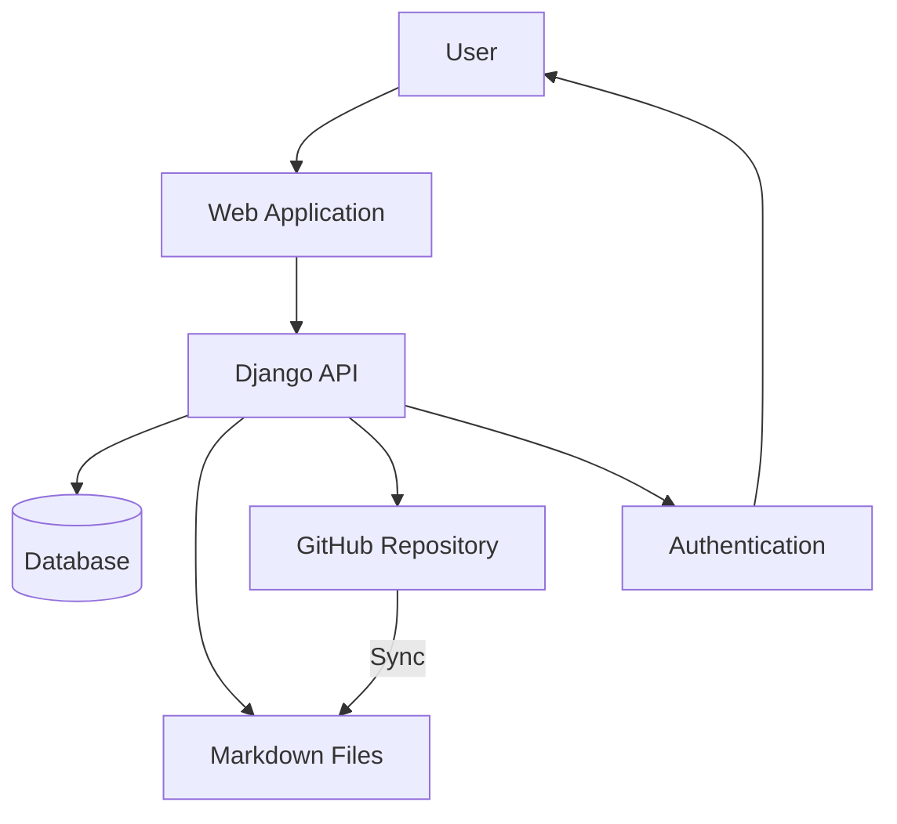
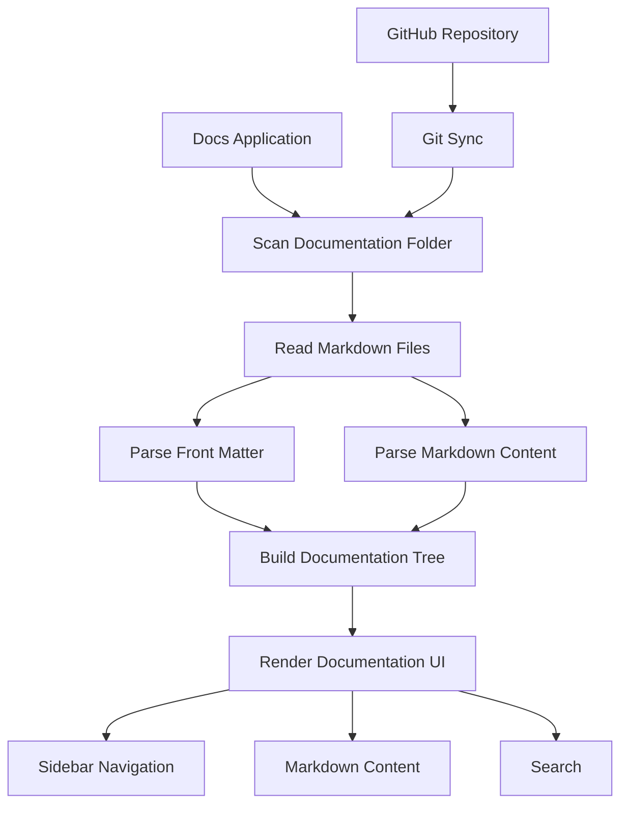

Here is a simple **Mermaid flowchart** example you can use in a Markdown document:

### Example: Business process

### Example: System architecture flow

For your **Docs web app**, a useful flow would be:

